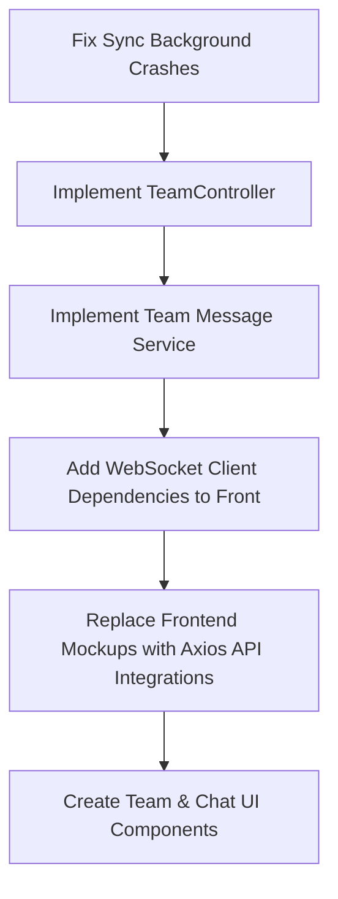

# Project Review Report: PsTracker

This report details a comprehensive review of the backend and frontend components of the PsTracker application. It lists key gaps, logic and architectural bugs, incomplete features, and recommendations for next steps.

---

## 1. Major Backend Logic & Thread Bugs

### 🚨 Background Thread Security Context Crash (`ImpCfService.java`)
- **Issue**: The `@Scheduled(fixedDelay = 2, timeUnit = TimeUnit.MINUTES)` method `syncCodforcesSubmissionData()` runs on a background thread.
- **Code**:
  ```java
  codeforcesSubmissionDto response = restClient.get()
          .uri("/user.status?handle={handle}&from=1&count=10", getUserCodeforecesHandle())
  ```
- **Bug**: `getUserCodeforecesHandle()` calls `SecuiryUserUtil.getCurrntUserId()`, which checks `SecurityContextHolder.getContext().getAuthentication()`. Because background scheduled threads do not have an HTTP request or security context, this call will throw `RuntimeException("Authentication required")`, causing the background sync task to crash immediately on every run.
- **Target User Issue**: Even if a security context existed, `getUserCodeforecesHandle()` would fetch the handle of the logged-in user rather than the `User` currently being iterated in the `for(User user : userList)` loop. It should query `user.getCodeforcesHandle()` directly.

### 🚨 Submissions Mapper Security Context Crash (`SubmissionMapper.java`)
- **Issue**: Inside the background sync loop, `submissionMapper.toEntity(submission)` is called to map the Codeforces result to a local `Submission` entity.
- **Code**:
  ```java
  public Submission toEntity(CodeforcesSubmissionResult codeforcesSubmissionResult) {
      Problem problem = problemMapper.ToEntity(codeforcesSubmissionResult.getProblem());
      Long userId = SecuiryUserUtil.getCurrntUserId();
      User user = userRepository.findById(userId)...
  ```
- **Bug**: Similar to above, calling `SecuiryUserUtil.getCurrntUserId()` in a mapper called by a scheduled task will crash with `Authentication required`. Furthermore, it would assign all synced submissions to the logged-in user rather than the iterated user.
- **Fix**: The mapper method should accept the target `User` (and `Problem`) as arguments: `public Submission toEntity(CodeforcesSubmissionResult result, User user, Problem problem)`.

### ⚠️ Transient/Detached Problem Reference in Sync
- **Issue**: During background synchronization, if a problem already exists in the database, the code does not load it.
- **Code**:
  ```java
  Problem problem = problemMapper.ToEntity(submission.getProblem());
  ...
  if(!problemRepository.existsByName(problem.getName())){
      problemRepository.save(problem);
  }
  ```
- **Bug**: If the problem already exists, `problem` is a transient object with a null ID. When saving the submission, passing this transient object will either cause Hibernate to throw a transient entity exception or attempt to save a duplicate problem, causing constraint violations.
- **Fix**: Fetch the existing problem or save-and-use the returned instance:
  ```java
  Problem dbProblem = problemRepository.findByName(problem.getName())
          .orElseGet(() -> problemRepository.save(problem));
  ```

---

## 2. Gaps & Missing Backend Components

### 🛑 Missing `TeamController`
- **Status**: The backend has a complete implementation of `TeamsService` (`createTeam`, `JoinTeam`, `leaveTeam`, `getTeamById`), but there is **no REST controller** to expose these services.
- **Impact**: Frontend clients cannot create, join, or leave teams over HTTP.
- **Fix**: Create a `TeamController` under `com.TrainingTracker.TraingingTracker.Controllers`.

### 🛑 Missing Team Chat / Messages Logic
- **Status**: Database schema, `TeamMessage` JPA entity, and `TeamMessageRepository` are defined, but there is **no service layer** (`TeamMessageService`) or controller/WebSocket mappings to handle sending, fetching, or broadcasting team chat messages.
- **Impact**: The chat/message functionality is entirely unimplemented.

### ⚠️ Incorrect Endpoint Annotations (`AnnouncmentController.java`)
- **Code**:
  ```java
  @PostMapping("/sendAnnouncmnet")
  public void sendAnnouncment(@Payload AnnouncmentCreateDto announcmentCreateDto)
  ```
- **Issue**: `@Payload` is a WebSocket mapping annotation. For a REST controller mapping (`@PostMapping`), `@RequestBody` should be used instead. Using `@Payload` will prevent Spring MVC from correctly parsing the JSON request body.
- **Param Annotations**: The `/getAllForUser` and `/getAllForTeam` endpoints should explicitly use `@RequestParam` annotations for readability and robustness.

### ⚠️ Redundant Security Matchers (`SecurityConfiguration.java`)
- **Issue**: Paths such as `/api/courses/popular`, `/api/departments/all`, `/api/feedbacks/recent` are permitted, and `/api/audit-logs/**` requires Admin authority.
- **Impact**: These configurations reference resources/controllers that do not exist in the codebase.

---

## 3. Frontend Gaps (Major Gap)

### 🛑 Pure Mockup Dashboard & Views
- **Status**: The entire React application is populated by static mock files (`src/data/mockProfile.ts`).
- **Impact**: The dashboard does not connect to the backend APIs. No `axios` calls exist in the `pages` or `hooks` (aside from the Axios dependency declaration in `package.json`).
- **Details**:
  - `useLogin.ts` and `useRegister.ts` contain `TODO: connect to auth API` and simply print credentials to the console.
  - Profile card, consistency heatmaps, and recent submissions are all hardcoded mockups.

### 🛑 Missing WebSocket Client Library
- **Status**: Backend implements WebSocket STOMP endpoint (`/ws/**`) and JWT validation headers (`WebSocketAuthInterceptor`).
- **Impact**: Frontend does not import/depend on `@stomp/stompjs` or `sockjs-client` in `package.json`, and contains no socket listener hook.

### 🛑 Missing Team UI
- **Status**: No references to "team", "join", or "leave" views/components exist in the frontend `src` folder.

---

## 4. Summary & Action Plan



1. **Phase 1: Fix background task crashes** by refactoring `ImpCfService` and `SubmissionMapper` to avoid `SecuiryUserUtil.getCurrntUserId()` in scheduled tasks.
2. **Phase 2: Complete Backend Web API** by creating `TeamController` and completing the `TeamMessage` (chat) service/websocket endpoints.
3. **Phase 3: Connect Frontend to APIs** by replacing mockup code with `axios` HTTP calls, connecting WebSocket clients, and implementing the team management views.
