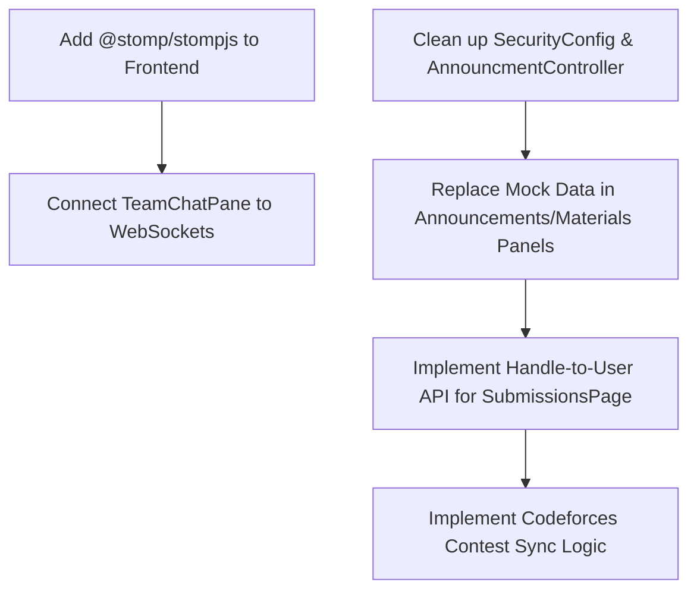

# Updated Project Review Report: PsTracker

This review provides a comprehensive analysis of the current state of both the backend and frontend codebases. It highlights the remaining bugs, technical debt, and missing features that need to be addressed to reach production readiness.

---

## 1. Backend Review: What's Missing & Bugs

### 🛑 Missing Codeforces Contest Data Sync
- **Location**: `ImpCfService.java`
- **Issue**: The `@Scheduled(fixedDelay = 12, timeUnit = TimeUnit.HOURS)` method `syncCodeforcesUserData()` is completely empty aside from a `//TODO`.
- **Impact**: The system currently does not sync or track user contest data/ratings from Codeforces, meaning any features relying on user ranking progression will fail to populate.

### ⚠️ Fragile Endpoint Annotations
- **Location**: `AnnouncmentController.java`
- **Issue**: The endpoints `/getAllForUser` and `/getAllForTeam` accept `Long userId` and `Long teamId` respectively, but they are missing the `@RequestParam` annotations.
- **Fix**: Update the signatures to explicitly bind the parameters, e.g., `public ResponseEntity<List<AnnouncementResponseDto>> geAll(@RequestParam Long userId)`.

### ⚠️ Redundant Security Matchers & Tech Debt
- **Location**: `SecurityConfiguration.java`
- **Issue**: The `SecurityFilterChain` allows public access to non-existent endpoints like `/api/courses/popular`, `/api/departments/all`, and `/api/feedbacks/recent`. It also configures `"Admin"` role requirements for missing `/api/audit-logs/**` and `/api/permissions/**` controllers.
- **Fix**: Remove obsolete matchers to clean up the security configuration and avoid confusion for future developers.

*(Note: The previously reported crashes in scheduled threads and missing `TeamMessage` backend layers have been successfully **FIXED**!)*

---

## 2. Frontend Review: What's Missing & Bugs

### 🛑 Missing WebSocket Client & Chat Integration
- **Location**: `package.json` & `TeamChatPane.tsx`
- **Issue**: The backend now fully supports WebSocket team messaging via STOMP (`/teams/{teamId}/messages`), but the frontend lacks the necessary libraries (`@stomp/stompjs` and `sockjs-client`). 
- **Impact**: Real-time team chat is currently non-functional. `TeamChatPane.tsx` is still rendering hardcoded mock messages (`MOCK_MESSAGES`).

### 🛑 Hardcoded Mock Data in UI Panels
- **Location**: `AnnouncementsPanel.tsx` & `MaterialsPanel.tsx`
- **Issue**: Despite Axios being configured in the project, these specific panels are still importing `MOCK_ANNOUNCEMENTS` and `MOCK_MATERIALS` from `src/data/mockProfile.ts` instead of fetching data dynamically.
- **Fix**: Create `useAnnouncements` and `useMaterials` hooks using Axios, and map them to their corresponding backend controllers.

### ⚠️ Hardcoded User ID Resolution
- **Location**: `SubmissionsPage.tsx`
- **Issue**: To view a specific trainee's submissions, the page relies on a hardcoded mapping dictionary (`MOCK_USER_IDS` and `MOCK_TRAINEES`) to convert a URL handle into a numeric `userId`.
- **Fix**: Implement a proper backend endpoint for handle-to-user lookup, or return the numeric `userId` directly from the team members list API so the frontend doesn't need to guess it.

---

## 3. Recommended Action Plan

1. **Phase 1: Finish UI API Integration**: Target the remaining mock data files in the frontend. Wire up Announcements, Materials, and the Trainee profile lookup in the Submissions page.
2. **Phase 2: Enable Real-time Chat**: Install STOMP on the frontend and connect `TeamChatPane.tsx` to the existing backend WebSocket endpoints.
3. **Phase 3: Backend Clean-up**: Implement the missing Codeforces Contest sync logic and clean up the `SecurityConfiguration`.
